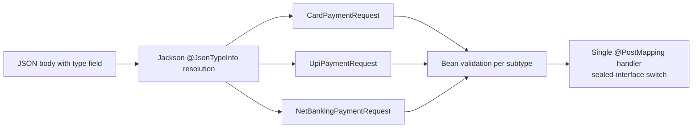

# Learning Polymorphic REST APIs


Designing REST endpoints whose payloads are **polymorphic** — one endpoint, many concrete
shapes (`CardPayment | UpiPayment | NetBankingPayment`) — done properly with Jackson subtype
handling, bean validation per subtype, and an OpenAPI contract that documents the
discriminator.

> **Status: planned.** The repo currently holds only scaffolding (`.gitignore`); this README
> documents the design the code will implement, so the roadmap is explicit rather than
> aspirational code.

---

## Table of contents

1. [The problem](#1-the-problem)
2. [Jackson polymorphism toolbox](#2-jackson-polymorphism-toolbox)
3. [Design chosen for this repo](#3-design-chosen-for-this-repo)
4. [OpenAPI: oneOf + discriminator](#4-openapi-oneof--discriminator)
5. [Validation & error shape](#5-validation--error-shape)
6. [Security note: why never enable default typing](#6-security-note-why-never-enable-default-typing)
7. [Planned module layout](#7-planned-module-layout)
8. [Further reading](#8-further-reading)

---

## 1. The problem

A `POST /payments` endpoint must accept several payment methods with different required
fields. Three naive designs all hurt:

| Anti-pattern | Pain |
|---|---|
| One mega-DTO with every field nullable | Validation becomes if-soup; the contract lies |
| Endpoint per subtype (`/payments/card`, `/payments/upi`) | Client switch statements; N endpoints to version |
| `Map<String,Object>` payloads | No contract at all |

The polymorphic answer: one endpoint, an explicit **discriminator field**, and the
framework resolves the concrete type:

```json
POST /api/v1/payments
{ "type": "CARD", "amount": 499.00, "cardNumber": "4111...", "cvv": "123" }
{ "type": "UPI",  "amount": 499.00, "vpa": "user@upi" }
```



## 2. Jackson polymorphism toolbox

| Annotation | Role |
|---|---|
| `@JsonTypeInfo(use = NAME, include = EXISTING_PROPERTY, property = "type", visible = true)` | Declares the discriminator; `EXISTING_PROPERTY` keeps `type` a real, validatable field |
| `@JsonSubTypes({@Type(value = CardPaymentRequest.class, name = "CARD"), ...})` | Maps discriminator values to classes |
| `@JsonTypeName("CARD")` | Alternative per-subtype naming |
| `PolymorphicTypeValidator` | Allow-list guard when type names come from data |

Modern Java pairing: make the parent a **sealed interface** — the compiler then guarantees
the `@JsonSubTypes` list and the business `switch` cover the same set:

```java
@JsonTypeInfo(use = Id.NAME, include = As.EXISTING_PROPERTY, property = "type", visible = true)
@JsonSubTypes({
    @JsonSubTypes.Type(value = CardPaymentRequest.class, name = "CARD"),
    @JsonSubTypes.Type(value = UpiPaymentRequest.class,  name = "UPI")
})
public sealed interface PaymentRequest permits CardPaymentRequest, UpiPaymentRequest {
    String type();
    BigDecimal amount();
}

public record CardPaymentRequest(String type, @NotNull @Positive BigDecimal amount,
        @CreditCardNumber String cardNumber, @Pattern(regexp = "\\d{3}") String cvv)
        implements PaymentRequest {}
```

Responses go polymorphic the same way — the discriminator is serialized back, so clients
can dispatch without sniffing fields.

## 3. Design chosen for this repo

- **Discriminator**: explicit `type` string enum, `EXISTING_PROPERTY` + `visible = true`
- **Sealed interface + records** for request/response hierarchies — exhaustiveness at compile time
- **Single controller endpoint**, service-level `switch (request)` pattern matching
- **Strategy pattern** underneath: `PaymentHandler<T extends PaymentRequest>` beans keyed by type for open/closed extension
- **No class names on the wire, ever** (`use = Id.CLASS` banned — see security note)

## 4. OpenAPI: oneOf + discriminator

Polymorphism is contract-first representable — springdoc generates this from the
annotations:

```yaml
PaymentRequest:
  oneOf:
    - $ref: '#/components/schemas/CardPaymentRequest'
    - $ref: '#/components/schemas/UpiPaymentRequest'
  discriminator:
    propertyName: type
    mapping:
      CARD: '#/components/schemas/CardPaymentRequest'
      UPI: '#/components/schemas/UpiPaymentRequest'
```

Generated clients (openapi-generator) then produce proper subtype hierarchies instead of
`Object`.

## 5. Validation & error shape

- Subtype-specific constraints live on the subtype record — `@Valid` cascades after Jackson resolves the type
- Unknown discriminator → Jackson `InvalidTypeIdException` → advice maps to `400` ProblemDetail listing allowed values
- Cross-field rules (`cvv` required only for cards) stay inside the card record — no global if-soup

## 6. Security note: why never enable default typing

Jackson's `enableDefaultTyping()` / `@JsonTypeInfo(use = Id.CLASS)` deserializes attacker
supplied class names — the root of a long CVE family (gadget-chain RCE). Rules this repo
follows:

- discriminator values are **logical names**, mapped through an explicit `@JsonSubTypes` allow-list
- never `Id.CLASS`/`Id.MINIMAL_CLASS` on internet-facing DTOs
- if dynamic typing is unavoidable, register a strict `PolymorphicTypeValidator`

## 7. Planned module layout

```
learning-polymorphic-rest-api/
├── pom.xml                        # super-pom parent, Java 25, Spring Boot 4
└── payment-api/
    ├── src/main/java/...          # sealed DTOs, controller, strategy handlers
    ├── src/main/resources/        # application-local.yml / application-prod.yml
    └── src/test/java/unit|intg    # @WebMvcTest subtype round-trips, error cases
```

Roadmap: scaffold module → sealed DTO hierarchy → strategy handlers → springdoc contract →
negative tests (unknown type, wrong-subtype fields) → generated TypeScript client demo.

## 8. Further reading

- [Jackson polymorphic deserialization docs](https://github.com/FasterXML/jackson-docs/wiki/JacksonPolymorphicDeserialization)
- [OpenAPI 3 — oneOf & discriminator](https://swagger.io/docs/specification/v3_0/data-models/inheritance-and-polymorphism/)
- [Baeldung — inheritance with Jackson](https://www.baeldung.com/jackson-inheritance)
- [CVE history of Jackson default typing](https://cowtowncoder.medium.com/on-jackson-cves-dont-panic-here-is-what-you-need-to-know-54cd0d6e8062)
